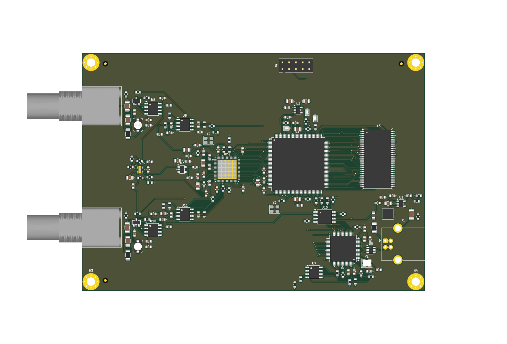

# dual-adc-usb-2: dual 12-bit / 10 MSPS USB capture board

Built from scratch from the requirements in `dual-adc-prompt.txt`:
- The option lists and rationale are in [`design_decisions.md`](design_decisions.md).
- The kicad-happy analysis and review are in [`design_review.md`](design_review.md).

## What it is
- 2 × BNC inputs: ±10 V full scale (±10.6 V clip), 1 MΩ ∥ ≈20 pF, compatible with scope probes.
- LTC2291 dual 12-bit ADC clocked at 10 MSPS from a dedicated 10 MHz XO.
- iCE40HX4K FPGA with 8 MB SDRAM. That holds 0.2 s of both channels at full rate; the requirement is 0.1 s.
- FT2232H USB 2.0 High-Speed interface:
  - Channel B: 245 FIFO for data and commands.
  - Channel A: MPSSE, which programs the FPGA's flash with `iceprog`.
- Bus powered at about 1.4 W (estimated), on a USB-B connector. USB-C wasn't needed.
- 130 × 90 mm, 4 layers: F.Cu signal, In1 GND, In2 +3V3, B.Cu signal.

## Status (2026-10-09)
- KiCad ERC: **0 violations**.
- DRC: **0 errors, 0 unconnected, 0 schematic-parity issues**. The 19 warnings are silkscreen plus one library-copy note.
- BOM has an MPN on every line (61 lines, 187 parts).
- Fab outputs are in `fab/`.
- **Before ordering:** check the LTC2291 and FT2232H against their datasheets (not available here), and accept the 0.1 mm rule on the ADC bus. See design_review.md.



## Files
| Path | Content |
|------|---------|
| `dual_adc_usb.py` | **Source of truth.** SKiDL circuit description. |
| `fpga_pinmap.json` | FPGA I/O assignment, optimized for the PCB placement (`scripts/pin_swap.py`); `dual_adc_usb.py` reads it. |
| `kicad/` | KiCad 10 project: `dual_adc_usb.kicad_sch` + 8 sub-sheets, `dual_adc_usb.kicad_pcb`, schematic PDF, ERC/DRC JSON. |
| `gateware/dual_adc_usb.pcf` | iCE40 pin constraints, generated from the final netlist. |
| `fab/` | Gerbers + drill (zip and loose), position file, grouped BOM. |
| `docs/` | 3D renders, assembly PDFs. |
| `lib/` | KiCad 10 symbol libraries flattened from `.kicad_symdir`, because SKiDL can't read symdirs. |
| `datasheets/` | Datasheets that could be downloaded (TI, Lattice, ISSI, Diodes). |
| `analysis/` | kicad-happy analyzer output. |
| `schematizer_out/` | Rejected output of SKiDL's built-in schematic generator, kept as evidence (design_decisions.md D11). |
| `scripts/` | Generation pipeline (below). |

## Regenerating
```bash
python3 dual_adc_usb.py --sch                 # SKiDL -> dual_adc_usb_skidl.net + kicad/*.kicad_sch
K=~/bin/kicad10-root/bin
$K/kicad-cli sch export netlist --format kicadsexpr -o kicad/dual_adc_usb.net kicad/dual_adc_usb.kicad_sch
python3 scripts/compare_netlists.py dual_adc_usb_skidl.net kicad/dual_adc_usb.net   # must show no differences
scripts/route_pipeline.sh kicad/dual_adc_usb.net /tmp/route 40
#   build_pcb (placement) -> fanout (plane vias) -> preroute_usb -> DSN (inner layers = planes)
#   -> Freerouting -> SES import
scripts/finalize.sh /tmp/route/routed.kicad_pcb
#   leftover fanout, outer GND pours, A* completion with rip-up, cleanup, fields, fiducials, refill, DRC
scripts/export_outputs.sh                      # fab/ + docs/ + ERC/DRC reports
python3 scripts/gen_pcf.py kicad/dual_adc_usb.net gateware/dual_adc_usb.pcf
```
Freerouting results vary slightly between runs. The board in `kicad/` is the one that was verified.
