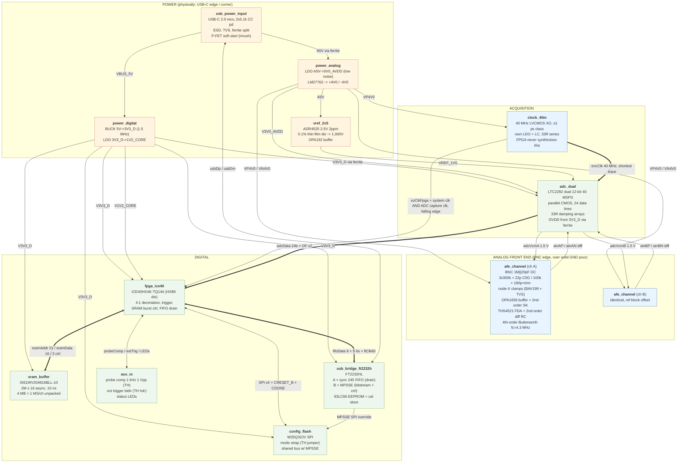
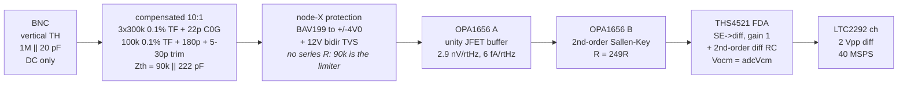
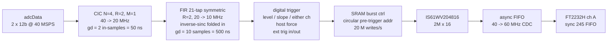

# Block Diagram — `dual_adc_usb`

- **Stage:** architecture
- **Date:** 2026-09-06
- **Coding mode:** **MODULAR** — 12 blocks, one `@SubCircuit` per block file under `circuits/dual_adc_usb/`
- **Basis:** SPEC.md §1–§6 (user-approved), binding constraints 1–13

Every block below is a clean `@SubCircuit` candidate. Exact function signatures are derived in
`net_plan.md`; block names here are the Python function names (snake_case).

---

## 1. System block diagram



---

## 2. Signal chain (one channel, left to right)



**Cumulative analog response: 4th-order Butterworth, fc = 4.3 MHz** (2nd order in the SK stage,
2nd order around the FDA). See `design_risks.md` §3 for why 4.3 MHz and not 4.0 MHz.

---

## 3. Gateware data path (informational — constrains the hardware interface only)



**Total decimation-filter group delay = 550 ns = 5.5 decimated samples.** This is the calibratable
trigger offset required by SPEC §8.2. Derivation and alternatives in `design_risks.md` §4.

---

## 4. Block manifest (for the orchestrator's `block_manifest`)

| # | Block (`snake_case`) | File | Instances | Ref prefix range | Notes |
|---|---|---|---|---|---|
| 1 | `usb_power_input` | `usb_power_input.py` | 1 | J1, D1–D3, L1–L2, C1–C6, R1–R4, Q1 | TH: none; USB-C is SMD |
| 2 | `power_digital` | `power_digital.py` | 1 | U1–U2, L3, C10–C19, R10–R12 | buck + 1V2 LDO |
| 3 | `power_analog` | `power_analog.py` | 1 | U3–U4, L4–L6, C20–C39, R20–R25 | AVDD LDO + LM27762 |
| 4 | `vref_2v5` | `vref_2v5.py` | 1 | U5–U6, R30–R33, C40–C45 | ADR4525 + divider + buffer |
| 5 | `afe_channel` | `afe_channel.py` | **2** (A, B) | ch A: 100-block, ch B: 200-block | parameterised; TH BNC |
| 6 | `adc_dual` | `adc_dual.py` | 1 | U7, RN1–RN6, C50–C75 | LTC2292 |
| 7 | `clock_40m` | `clock_40m.py` | 1 | U8–U9, L7, C80–C85, R40–R41 | XO + own LDO |
| 8 | `fpga_ice40` | `fpga_ice40.py` | 1 | U10, C90–C115, R50–R55, L8 | iCE40HX4K-TQ144 |
| 9 | `sram_buffer` | `sram_buffer.py` | 1 | U11, C120–C123 | IS61WV204816 |
| 10 | `config_flash` | `config_flash.py` | 1 | U12, R60–R65, C125, JP1 | TH mode strap |
| 11 | `usb_bridge_ft2232h` | `usb_bridge_ft2232h.py` | 1 | U13–U14, Y1, L9–L10, C130–C150, R70–R80 | FT2232HL + EEPROM |
| 12 | `aux_io` | `aux_io.py` | 1 | J4–J6, R90–R99, D10–D13 | TH trigger hdr + probe-comp terminal |

Assembly file `__main__.py` creates all nets listed in `net_plan.md` §1 and calls the 12 blocks
(with `afe_channel` called twice).

---

## 5. Physical floorplan intent (carried to layout, not to SKiDL)

```
+--------------------------------------------------------------+  ~100 x 80 mm, 4 layer
| BNC A (TH)   [ afe_channel A ]                               |  L1 sig / L2 solid GND /
| BNC B (TH)   [ afe_channel B ]   [adc_dual]  [clock_40m]     |  L3 pwr / L4 sig
|              -- solid uninterrupted GND pour under AFE --    |
|  [vref_2v5]  [power_analog]      [fpga_ice40]  [sram_buffer] |
|                                                              |
| probe-comp TH  ext-trig TH   [config_flash] [usb_bridge]     |
| [power_digital BUCK + keep-out] .................. USB-C     |
+--------------------------------------------------------------+
```

- BNCs on the opposite edge from USB-C and the buck (SPEC §5).
- Buck in the corner with a keep-out; `clock_40m` XO within ~10 mm of the ADC ENC pin.
- `afe_channel` ground return kept on an uninterrupted pour; no digital return current crosses it.
