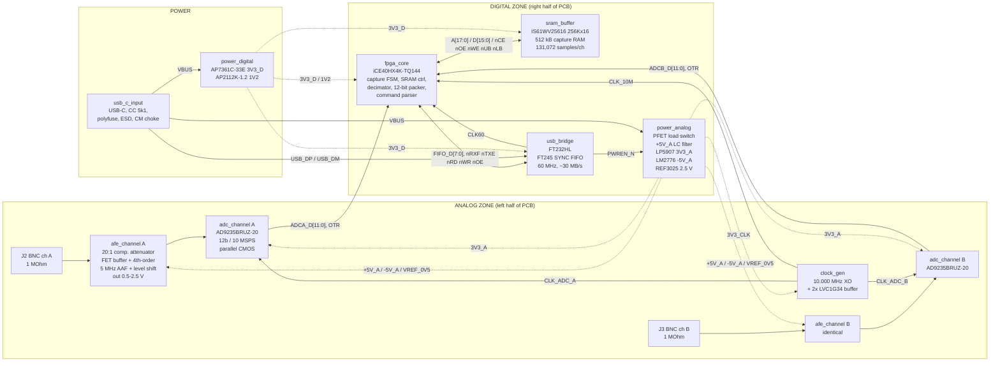
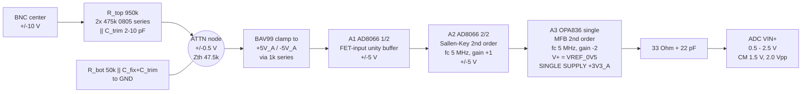
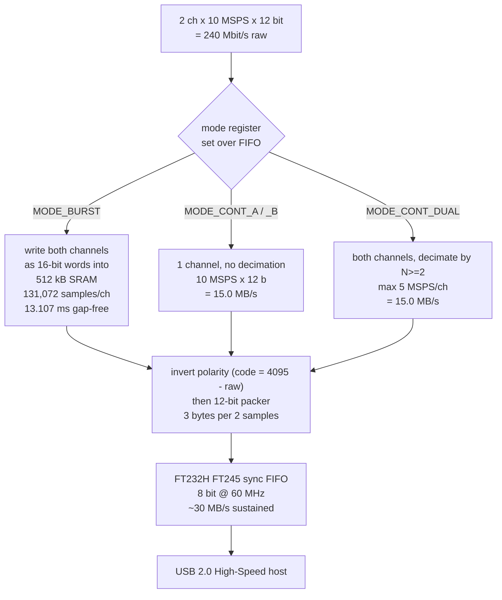

# Block Diagram — dual_adc_usb

Dual-channel, ±10 V, 12-bit, 10 MSPS/channel simultaneous-sampling USB 2.0 acquisition
board. USB bus powered (5 V / 500 mA ceiling), 4-layer PCB, ~100 × 70 mm.

## Top-level signal flow

## Analog front end, one channel (detail)

Cascade of the two 2nd-order sections gives a **4th-order Butterworth anti-alias
response, fc = 5.0 MHz**: −3 dB at 5 MHz, −38 dB at 15 MHz, −48 dB at 20 MHz — meets the
[HARD] "≥40 dB by 15–20 MHz" requirement (2nd order would only give 19/24 dB, 3rd order
29/36 dB — see `design_risks.md` R-06).

A3 runs from **+3V3_A single supply**, so its output physically cannot exceed the ADC's
AVDD — this is the ADC over-voltage protection, replacing clamp diodes (whose leakage
would cost ~0.7 LSB of offset).

## Data path

Burst readout: 131,072 samples/ch × 2 ch × 1.5 B = **393,216 bytes**, ≈13 ms at 30 MB/s.

## Block list

| # | block_id | Zone | Instances |
|---|----------|------|-----------|
| 1 | `usb_c_input`   | connector/power | 1 |
| 2 | `power_digital` | power   | 1 |
| 3 | `power_analog`  | power   | 1 |
| 4 | `clock_gen`     | analog  | 1 |
| 5 | `afe_channel`   | analog  | 2 (A, B) |
| 6 | `adc_channel`   | analog  | 2 (A, B) |
| 7 | `sram_buffer`   | digital | 1 |
| 8 | `usb_bridge`    | digital | 1 |
| 9 | `fpga_core`     | digital | 1 |

## Ground and zoning

**One continuous GND net / one solid ground plane on layer 2** (no split plane, no
0 Ω link). Isolation is achieved by *placement*: the analog zone (BNCs, attenuators,
op-amps, ADCs, XO) occupies the left half over unbroken ground; the digital zone (FPGA,
SRAM, FT232H) occupies the right half. The ADC packages straddle the boundary with their
analog pins facing left and DRVDD/data pins facing right. This follows the modern
ADI/Kester recommendation and avoids the return-current discontinuities a split plane
creates under the 39-line SRAM bus. See `design_risks.md` R-03/R-04.

## Stackup

| Layer | Use |
|-------|-----|
| L1 | Signal — analog front end (left), digital routing (right) |
| L2 | **Solid GND plane, no splits** |
| L3 | Power: 3V3_D / 3V3_A / 5V_A / −5V_A / 1V2 pours, each fully over the L2 plane |
| L4 | Signal — SRAM/FIFO bus, low-speed routing |
