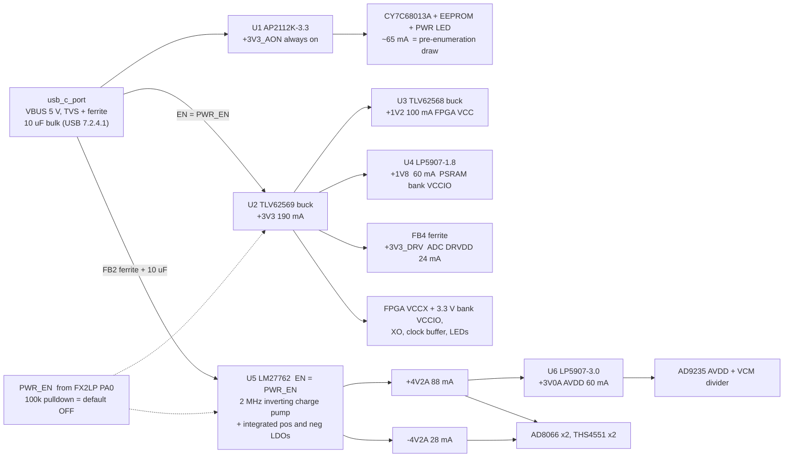

# Block diagram — dual_adc_usb

Dual-channel 12-bit / 10 MSPS simultaneous-sampling digitizer, USB 2.0 HS bus-powered.

## Signal flow

```mermaid
flowchart LR
  subgraph AFE1["analog_frontend (CH1 instance)"]
    BNC1["J: BNC jack<br/>CH1_IN"] --> ATT1["909k/90.9k comp. divider<br/>÷11, 1M ohm || ~18 pF"]
    ATT1 --> CLMP1["1k + BAV199<br/>clamp to +/-4V2A"]
    CLMP1 --> BUF1["AD8066 A<br/>unity buffer"]
    BUF1 --> SK1["AD8066 B<br/>Sallen-Key 2-pole<br/>3.95 MHz, Q=1.33"]
    SK1 --> FDA1["THS4551<br/>diff MFB 2-pole 3.9 MHz Q=0.55<br/>gain 1.10, SE to diff"]
  end
  subgraph AFE2["analog_frontend (CH2 instance)"]
    BNC2["J: BNC jack<br/>CH2_IN"] --> ATT2["identical chain"] --> FDA2["THS4551"]
  end

  FDA1 -->|"CH1_ADC_P/N<br/>2 Vpp diff @ 1.50 V CM"| ADC["adc_pair<br/>2x AD9235BCPZ-40<br/>12 bit, parallel CMOS"]
  FDA2 -->|"CH2_ADC_P/N"| ADC

  CLK["clock_gen<br/>SiT1602 10.000 MHz XO<br/>SN74LVC2G34 fanout"] -->|CLK_ADC1| ADC
  CLK -->|CLK_ADC2| ADC
  CLK -->|CLK_FPGA| FPGA

  ADC -->|"ADC1_D[11:0], ADC1_OTR"| FPGA
  ADC -->|"ADC2_D[11:0], ADC2_OTR"| FPGA

  subgraph FPGA["fpga_capture — GW1NR-LV9QN88PC6/I5"]
    CAP["capture + trigger<br/>compare vs host threshold"] --> PACK["bit-packer<br/>4 samples -> 3x16b"]
    PACK --> FIFO["BSRAM elastic FIFO<br/>468 kbit"]
    FIFO --> PSR["embedded PSRAM<br/>64 Mbit / 8 MiB, 1.8 V<br/>burst buffer, 2.8 Mpt/ch"]
    PSR --> DRAIN["stream / drain engine<br/>+ overrun flag"]
    FIFO --> DRAIN
  end

  DRAIN -->|"FD[7:0], IFCLK, SLWR_N,<br/>SLRD_N, SLOE_N, FIFOADR[1:0],<br/>FLAGA/B/C, PKTEND_N"| FX2["usb_controller<br/>CY7C68013A-56LTXC<br/>slave FIFO, 8-bit @ 48 MHz"]
  FX2 -->|USB_DP / USB_DM| USBC["usb_c_port<br/>USB-C 16P, 2x 5.1k CC<br/>USBLC6-2SC6 ESD"]
  USBC <-->|"bulk IN 30 MB/s<br/>vendor control EP"| HOST(["USB 2.0 HS host"])
  EEP["CAT24C128 EEPROM<br/>I2C addr 0xA2"] <--> FX2
  JT["JTAG 2x3 header"] <--> FPGA
  AUX["aux_io<br/>3-pin ext trigger 3V3<br/>PWR / CAP LEDs"] <--> FPGA
```

## Power tree

**Why PWR_EN exists:** requirement P3 caps pre-enumeration draw at 100 mA. Everything except
the FX2LP, its EEPROM and the power LED sits behind PWR_EN, so the board draws ~65 mA until
firmware has enumerated and requested 500 mA. The 100 k pulldown is mandatory — FX2LP PORTA
pins are high-Z after reset.

## Why this shape

The two constraints that set the architecture are requirement 10 (bit-packing, 30 MB/s not
40 MB/s) and requirement 11 (a triggered burst that is lossless regardless of the host).
Neither can be met by a USB MCU alone: an FX2LP has a 4 kB FIFO and no arithmetic path fast
enough to repack 20 Msample/s. Putting an FPGA between the ADCs and the USB device gives
both for one part — the packer is ~40 LUTs and the burst buffer is the PSRAM already inside
the GW1NR-9 package. The FX2LP then does the one thing it is genuinely good at: an 8-bit
slave FIFO into a high-speed bulk endpoint, with no firmware in the data path at all.
