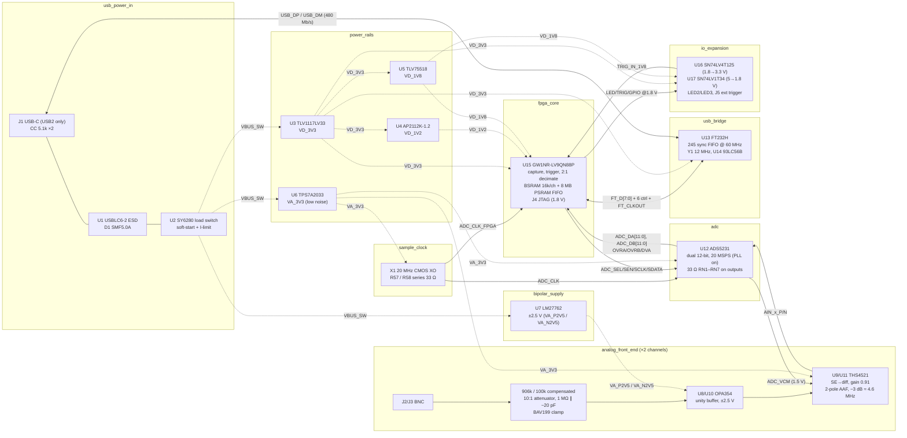

# Block diagram — dual_adc_usb

Nine blocks (modular coding mode). Solid arrows carry signals; dotted arrows carry power.
Block ids match `handoffs/02_architecture.md` § Block manifest.

## Signal flow and data rates

| Path | Rate | Notes |
|---|---|---|
| BNC → ADC | analog, −3 dB ≈ 4.6 MHz | ±10 V → ±0.904 V diff (89.5 % FS) |
| ADC → FPGA | 20 MSPS × 24 bit = 480 Mb/s parallel | 3.3 V CMOS; 6-clock latency; setup ≥ 10 ns / hold ≥ 20 ns at 20 MSPS |
| FPGA DSP | 2:1 half-band decimation → 10 MSPS/ch | gateware (out of scope) |
| FPGA → FT232H | 60 MHz × 8 bit bus; payload 30 MB/s packed (2×12 b → 3 B) | FT232H ceiling "up to 40 MB/s" |
| FT232H → host | USB 2.0 HS bulk | block capture guaranteed; streaming is best effort |

## Clock domains

1. **ADC domain, 20 MHz** — X1 → ADC_CLK (ADC) and ADC_CLK_FPGA (GCLKT_4). This is the only source of sample
   timing. It never passes through the FPGA PLL on its way to the ADC (F12).
2. **USB domain, 60 MHz** — FT232H CLKOUT → GCLKT_3. Present only in sync-FIFO mode.
3. **PSRAM/system** — FPGA rPLL derived from ADC_CLK_FPGA. FPGA-internal only.

CDC between 1 ↔ 3 ↔ 2 uses async FIFOs in gateware (out of scope, but the schematic provides the clocks).
