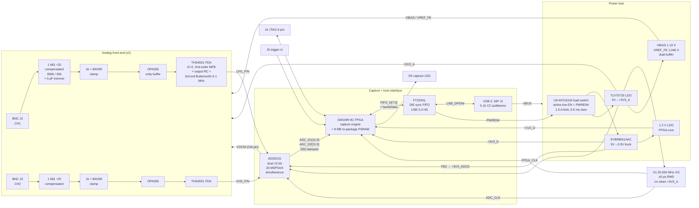

# Block diagram — dual_adc_usb

Dual-channel 12-bit digitizer. **Buffered capture**: burst into the FPGA's in-package
PSRAM, then read out over USB 2.0 HS. 8 functional blocks, 9 instances
(`afe_channel` is instantiated twice).

## Signal flow, in words

1. **±10 V at the BNC** is divided by 20 **passively** into a 1.20 V bias (not ground), so
   the whole active chain lives on a single +3.3 V rail — no negative rail, no boost.
   Node swing = **1.045 V ± 0.5 V** (rev 3: `VBIAS` 1.200 V → 1.100 V, ERC M-1).
2. A **unity-gain FET-input buffer** presents a high, stable impedance to the divider's
   47.5 kΩ output node; its input capacitance is absorbed into the divider's compensation.
3. A **fully differential amplifier at G = 2** subtracts `VREF_FE` (1.045 V), restores the
   2 V p-p differential full scale, sets the common mode from the ADC's own CM pin, and
   carries the anti-alias filter in its **multiple-feedback (MFB)** network plus one output RC
   — a **3rd-order Butterworth, −3 dB at 6.1 MHz** (rev 3; the rev-1/2 network was
   accidentally 2nd-order, ERC H-1). The MFB is what provides the *complex* pole pair; a
   cascade of plain RC sections cannot give a flat passband and a useful stopband at once.
4. One **dual ADC** samples both channels on the **same clock edge** from one oscillator —
   that single shared edge is what makes the channels simultaneous (requirement F1/D10).
5. The **FPGA** latches 24 parallel data bits at 20 MHz, writes them to its **in-package
   8 MB PSRAM** (104.9 ms of both channels at 20 MSPS), then streams the record out through
   the FT232H's synchronous FIFO.
6. The **host** decimates 2:1 to the required 10.0 MSPS/ch with a digital filter — which is
   also the final anti-alias stage, and is **mandatory, not optional**: it is what suppresses
   the 5–10 MHz octave the analog filter deliberately passes (requirement **S1**, risk
   **R-12**). No FPGA DSP is required to meet any HARD requirement.

<!-- revised: rev3 — FDA block label and signal-chain steps 1/3/6: ERC H-1 (3rd-order MFB
     Butterworth), M-1 (VBIAS 1.100 V), new requirement S1 (host decimation filter). -->

## Clock domains

| Domain | Source | Contents | Crossing |
|---|---|---|---|
| Sample, 20.000 MHz | X1 XO direct | ADC, FPGA input registers | none — ADC and FPGA share the XO, source-synchronous |
| Memory, ~120 MHz | FPGA PLL from `FPGA_CLK` | PSRAM controller | synchronous to sample domain (same PLL root) → rate FIFO only |
| USB FIFO, 60.000 MHz | `FIFO_CLK` from FT232H (own 12 MHz crystal) | FIFO master | **the only true asynchronous boundary** — needs a dual-clock async FIFO in the FPGA |

The ADC clock never passes through the FPGA (requirement F14/D10): `ADC_CLK` goes from X1
straight to the ADC, and a separate series-damped copy goes to the FPGA.
