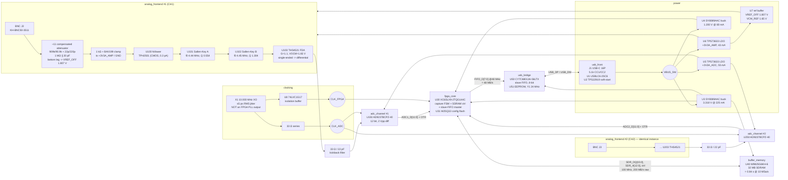

# Architecture — block diagram (dual_adc_usb)

Burst-capture digitiser: 2 ch x 10.000 MSa/s x 12 bit -> 32 MB SDRAM -> USB 2.0 HS bulk drain.
Topology (b) from the requirements: **two single-channel ADCs sharing one sample clock**.
See `ic_selection.md` for why, `net_plan.md` for the wiring contract.



## Signal flow, in words

1. **Acquire.** Host writes a start command over USB -> FX2 -> FPGA. The FPGA captures both
   12-bit buses on every rising edge of `CLK_FPGA` (the buffered copy of the same 10 MHz
   oscillator that clocks the ADCs), packs the pair into two 16-bit words, and streams them
   into SDRAM. 4 bytes per 100 ns = 40 MB/s written; SDRAM raw is 200 MB/s.
2. **Stop.** Capture ends at the programmed depth (up to 8.388 MSa/channel = 0.839 s).
3. **Drain.** The FPGA reads SDRAM and pushes bytes into the FX2 slave FIFO at 48 MB/s;
   the host pulls them over USB 2.0 HS bulk at ~35–43 MB/s. Full 32 MB drains in ~0.9 s.

Capture and drain never overlap — this is the burst architecture fixed by requirement F6.

## Clock tree (requirement 7, HARD)

```
X1 (10.000 MHz XO) ──33 Ω──┬── CLK_ADC ── U150.CLK  (AD9237 #1)
                           └────────────── U250.CLK  (AD9237 #2)   [matched stubs, ±5 mm]
X1 ──────── U8 74LVC1G17 ── CLK_FPGA ── U30 GCLK pin  (capture domain)
U30 internal DCM/PLL: CLK_FPGA x10 = 100 MHz  -> SDRAM domain only
U50 FX2 IFCLK (48 MHz, from FX2's own 24 MHz crystal) -> U30 (drain domain only)
```

The ADC sample clock is the raw oscillator output. No PLL, no FPGA output, no gate is in
that path. The FPGA's copy is taken through a buffer so that the FPGA's input capacitance
and any reflections on the long trace never appear on the ADC clock node.
