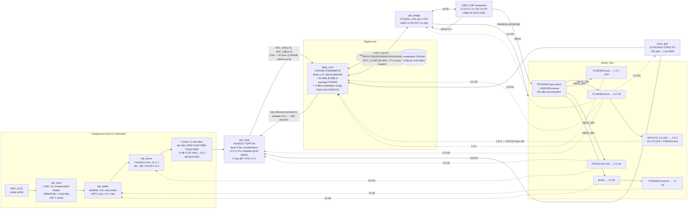

# Block diagram — dual_adc_usb

Burst digitizer: 2 ch × 12 bit × 10 MSPS simultaneous → 8 MB in-FPGA PSRAM → USB 2.0 HS read-out.
Bus-powered from USB-C, everything except the USB bridge gated behind a load switch until
enumeration completes.

## Signal flow, stage by stage

| # | Stage | In | Out | Why it is there |
|---|---|---|---|---|
| 1 | BNC + compensated divider | ±10 V (±55 V survivable) | ±0.909 V, Z = 1 MΩ ∥ 17.6 pF | Scope-probe-compatible load; the caps carry the signal above 12 kHz so bandwidth is not limited by 909 kΩ |
| 2 | Unity buffer (AD8066, ±5 V) | 82.6 kΩ source | low-Z ±0.909 V | JFET input (6 pA) — a bipolar input would put ~100 mV of offset across 82.6 kΩ |
| 3 | FDA (THS4521, +3.3 VA) | single-ended ±0.909 V | differential 2 Vpp on 1.5 V CM | ADS5231 needs 1.0–2.0 V per pin; single-ended drive cannot reach full scale legally |
| 4 | LC anti-alias, per leg | 2 Vpp diff | band-limited | 4 passive poles (L1,C1,L2,C2 on **two distinct nodes split by L2** — no shared-node collapse) + 1 FDA feedback pole. Recomputed rev.3 from the shipped values: **−3 dB 4.247 MHz, −0.68 dB at 4 MHz, −41.3 dB at 10 MHz** — SPEC F8 (≥3 dB BW 4 MHz, ≥40 dB at 10 MHz) met |
| 5 | ADS5231 | 2 Vpp diff, 10 MSPS | 2 × 12-bit parallel | One package ⇒ channel skew is internal, not a board problem |
| 6 | GW1NR-9 | 24-bit @10 MHz = 40 MB/s | PSRAM burst writes | 8 MB in package: no memory bus on the PCB at all |
| 7 | FT232H sync FIFO | PSRAM read-back | USB 2.0 HS bulk | ≥20 MB/s required, 30–40 MB/s practical |

## Capture / read-out sequence

1. Host opens the FT232H; PWREN# falls; TPS22918 turns on the rest of the board.
2. FPGA AUTOBOOTs from its 4 Mbit on-die configuration Flash (MODE[2:0]=000, DS117 §2.12.2 "instant on" — no dongle, no SPI flash, R-13 closed), then disables the ADC PLL over SEL/SEN/SCLK/SDATA (required below 20 MSPS).
3. Host writes a "capture" command through the FIFO. FPGA streams 24 bits/10 MHz through a BSRAM
   elastic FIFO into PSRAM until 1,000,000 samples/channel are stored (0.1 s).
4. Host reads 4,000,000 bytes back through the sync FIFO at 30–40 MB/s (~0.12 s).
