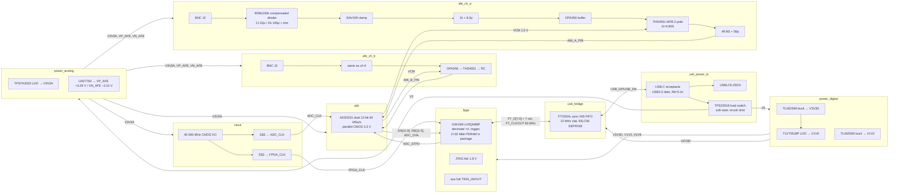

# Block diagram — dual_adc_usb (revision 1)

Two-channel, simultaneous, 12-bit digitizer. Each ±10 V BNC input goes through a 1 MΩ compensated
÷10.09 attenuator, a CMOS unity-gain buffer and an FDA (2-pole MFB filter) into one dual 12-bit ADC. The ADC
**oversamples at 40 MSa/s**. The FPGA decimates ×4 to 10 MSa/s per channel, stores the result in the
8 MB PSRAM inside the FPGA package, and uploads it through an FT232H USB 2.0 HS sync FIFO.

## Signal flow and rates
| Stage | Rate / level | Working |
|---|---|---|
| BNC → divider node | ×0.09911 | 100k/(909k+100k) → 0.09911 |
| Buffer (OPA356, G=+1) | ±1.111 V max at ±11.21 V in | 11.21 × 0.09911 → 1.111 V |
| FDA MFB | diff gain 0.909 | R2/R1 = 909/1000 → 0.909 |
| ADC input | 2.02 Vpp diff FS; CM = VCM 1.5 V | 0.09911 × 0.909 → 0.09009 V/V; 1.01/0.09009 → FS ±11.21 V |
| ADC output | 2 × 12 bit @ 40 MSa/s parallel | 24 data lines + DVA |
| FPGA decimator | 40 → 10 MSa/s per channel | ÷4 |
| PSRAM store | 40 MB/s (16-bit words) | 10e6 × 2 ch × 2 B → 40 MB/s |
| USB upload | ≈35 MB/s (FT232H sync FIFO) | 4 MB / 35 MB/s → 0.114 s |

## Ground and domains
One unbroken GND plane (net `GND`); analog parts are placed over their own region and never share
return paths with the FT232H/FPGA. There is no split AGND net. Rails: V5 (switched VBUS),
V3V3D, V1V2, V1V8 (digital); V3V3A, VP_AFE, VN_AFE (analog).
