# dual_adc_usb — Block diagram (rev 2)

<!-- revised: +1V8 rail for GW1NR VCCO3 (PSRAM bank); DV/OVR/SIWU# removed from the FPGA interface; Y1 swapped -->

Two DC-coupled ±10 V scope-style inputs → per-channel 1 MΩ compensated attenuator + FET buffer +
3rd-order anti-alias filter/differential driver → one dual simultaneous-sampling 12-bit ADC clocked
at 40 MSPS → FPGA (decimates 4:1 to 10 MSPS, stores in its embedded 64 Mbit PSRAM) → FT232H
synchronous-FIFO bridge → USB 2.0 High-Speed over a USB-C receptacle (Rd sink, bus-powered).

```mermaid
flowchart LR
  subgraph USB["usb_power_in"]
    J1["J1 USB-C (USB2.0, Rd 5.1k)"] --> F1["F1 PTC"] --> U2["U2 TPS22918<br/>soft-start load switch"]
    J1 --- U1["U1 USBLC6-2SC6 ESD"]
  end
  subgraph PWRD["pwr_digital"]
    U3["U3 TLV62569 buck<br/>+3V3D"]:::pwr
    U4["U4 TLV62569 buck<br/>+1V2 (FPGA core)"]:::pwr
    U12["U12 TLV62569 buck<br/>+1V8 (FPGA VCCO3 / PSRAM / JTAG)"]:::pwr
  end
  subgraph PWRA["pwr_analog"]
    U5["U5 TLV75733P LDO<br/>+3V3A"]:::pwr
    U6["U6 LM27762<br/>VAFE_P +3.36 / VAFE_N -3.42"]:::pwr
  end
  U2 -- VBUS_SW --> U3 & U4 & U12 & U5 & U6

  subgraph AFEA["afe_ch_a (afe_ch_b identical)"]
    J2["J2 BNC"] --> ATT["910k||(18p+2-6p trim) / 100k||200p<br/>÷10.1, 1.01 MΩ, ~20 pF"] --> CLMP["D20 BAV199 clamp<br/>to VAFE rails"] --> BUF["U20 OPA810<br/>FET buffer G=1"] --> MFB["U21 THS4521 FDA<br/>2-pole MFB, G=0.909"] --> RC["33Ω/270p diff<br/>3rd pole"]
  end
  J3["J3 BNC (ch B)"] --> AFEB["afe_ch_b"]
  RC -- "ADC_AINA_P/N" --> ADC
  AFEB -- "ADC_AINB_P/N" --> ADC
  ADC -- "ADC_VCM 1.5 V" --> MFB & AFEB

  subgraph CLK["clock_gen"]
    Y1["Y1 40 MHz CMOS XO<br/>OT322540MJBA4SL, 0.7 ps rms"] --> U8["U8 LVC buffer"]
  end
  Y1 -- "ADC_CLK (direct)" --> ADC
  U8 -- FPGA_CLK40 --> FPGA

  ADC["adc_dual: U7 ADS5231<br/>2×12-bit, 40 MSPS, simultaneous"] -- "ADC_DA[11:0], ADC_DB[11:0]" --> FPGA
  FPGA -- "ADC_SEL / MSBI / OEA / STPD / OEB" --> ADC

  FPGA["fpga: U9 GW1NR-LV9QN88P<br/>8.6k LUT, 20 mult, 64 Mbit PSRAM in-package<br/>4:1 FIR decimation → 10 MSPS"] <-- "FT_D[7:0], RXF#, TXE#, RD#, WR#, OE#, CLKOUT 60 MHz" --> BR
  BR["usb_bridge: U10 FT232H<br/>245 sync FIFO, 93LC56 EEPROM, 12 MHz xtal"] <-- "USB_DP / USB_DM" --> J1
  FPGA --- J4["J4 JTAG (1.8 V VREF)"] & J5["J5 trigger I/O (3.3 V)"]
  classDef pwr fill:#eef,stroke:#669
```

## Signal-flow summary

| Stage | Function | Key numbers (working in `net_plan.md` / `design_risks.md`) |
|---|---|---|
| Attenuator | 910 kΩ / 100 kΩ, compensated | ratio 100/1010 = 0.0990; Rin = 1.010 MΩ; Cin ≈ 20.3 pF + strays |
| Buffer | OPA810 unity-gain, ±3.4 V rails | input ≤ ±1.11 V at FS |
| AAF + driver | THS4521 MFB (2 poles) + output RC (1 pole) = 3rd order | gain 1000/1100 = 0.909; −3 dB 8.80 MHz; −0.16 dB @5 MHz; −35.8 dB @35 MHz |
| ADC | ADS5231, 2.02 Vpp diff FS, VCM 1.5 V, 40 MSPS | FS at BNC = ±11.22 V; LSB 5.48 mV |
| FPGA | 40 → 10 MSPS decimation, capture to PSRAM; 48/48 3.3 V I/O, bank 3 at 1.8 V | 8 MiB holds 0.2097 s @ 2 ch × 10 MSPS × 16 bit |
| USB | FT232H 245-sync FIFO, 60 MHz | readout of 4 MB capture ≈ 0.1–0.2 s |
| Power | VBUS 5 V → 3V3D / 1V2 / 1V8 bucks, 3V3A LDO, ±AFE LM27762 | est. 1.84 W max, 396 mA @ 4.4 V (×1.25 = 496 mA) → USB 2.0 budget OK <!-- revised --> |
